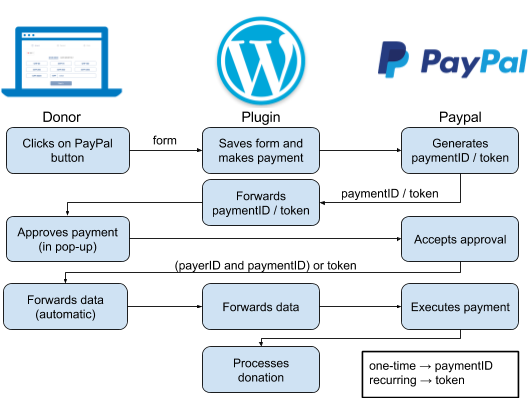
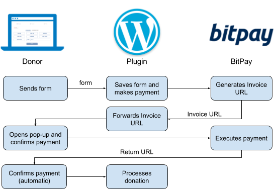

# Raise - The Free Donation Plugin for WordPress

Version: 0.12.10

Last modified: 2017-09-28

Raise is a WordPress plugin for handling donations. It was inspired by the donation widget on Barack Obama's former support page.

Main features:

*   Handle one-time donations from Stripe (credit card), PayPal, GoCardless (direct debit), BitPay (bitcoin), Skrill and bank transactions
*   Handle monthly donations from Stripe, PayPal, GoCardless, Skrill, and bank transactions
*   Configure several form instances (property inheritance support)
*   Assign donations to different accounts depending on currency or donor country
*   Sandbox API support for Stripe, PayPal, GoCardless, BitPay and Skrill
*   Send confirmation emails (Twig support) and notification emails
*   Send webhooks for logging and mailing list signup
*   Fully translatable (currently available in en and de)
*   Load and cache tax deduction settings from master instance
*   Country and currency detection based on donor's IP address (powered by freegeoip.net)
*   Compatible to the [matching campaign plugin](https://www.google.com/url?q=https://github.com/GBS-Schweiz/matching-campaigns&sa=D&ust=1507029742637000&usg=AFQjCNHwDyhWquq0EwS7K8aQeRTPUpGcBQ) for fundraisers

[1\. Introduction](#h.ykskh1ypgpac)

[1.1 Installation](#h.su0bg9c2sz2p)

[1.1.1 Manual](#h.5ujztpeg0jqv)

[1.1.2 Git](#h.kkg10eie9285)

[1.1.3 With Github Updater](#h.lydhon8d4rbm)

[1.2\. Fundraiser (only needed for setting up fundraising campaigns)](#h.vudvr2jkvk79)

[1.3\. Default form config sharing (optional)](#h.micvxmwnx12)

[1.4\. Payment flows](#h.xqgmn8ne5dfz)

[1.4.1 Bank Transfer](#h.gd4v1ctv1cmj)

[1.4.2 Stripe](#h.88inibbltl10)

[1.3.3 PayPal (simplified)](#h.a6emfeip80ef)

[1.4.4 GoCardless (simplified)](#h.mr23zhh0qq9b)

[1.3.5 BitPay (simplified)](#h.lqzv5mfmaum8)

[1.4.6 Skrill (simplified)](#h.2gnihd5l1q12)

[2\. Configuration](#h.nh1ejp610jcd)

[2.1 Amount](#h.qcl63foospuf)

[2.2 Payment](#h.1p36dgu3cyzy)

[3.2.1 Limitations](#h.ilv08g19u4pd)

[2.3 Finish](#h.gkgabnie1d35)

[2.4 Webhook](#h.a7yjgyiljfal)

[2.5 Log](#h.lmgsuyxc2c1q)

[2.6 Inherits](#h.oh2iw4t13stv)

[2.7 Campaign](#h.8d45lu5q1qpb)

[3\. Button colors](#h.k74y7hht2g7b)

[4\. Embedding the form in a page](#h.9e9l2z9shbl)

[5\. Updating labels](#h.2vnma81t291h)

[5.1\. English](#h.w6025twq7zum)

[5.2\. Other languages](#h.3q8ia18d14te)

[5.3\. Adding a new language](#h.nfmmgl2ihdh5)

[7\. Share tax deduction settings](#h.nwcr10w6jnwz)

[8\. Updating the plugin](#h.a3w2mecc562m)

[9\. Twig basics](#h.hjt3ihmgjtt8)

# 1\. Introduction

## 1.1 Installation

### 1.1.1 Manual

1.  Download the latest zip from [https://github.com/ea-foundation/eas-donation-processor](https://github.com/ea-foundation/eas-donation-processor).
2.  On the WordPress plugin admin page, click install and upload the zip file (or upload the zip to your /wp-content/plugins/ directory and extract all the files).
3.  Activate the plugin.
4.  If you want to use the donation plugin in the framework of a fundraiser campaign, install and activate the [Advanced Custom Fields plugin](https://www.google.com/url?q=https://wordpress.org/plugins/advanced-custom-fields/&sa=D&ust=1507029742648000&usg=AFQjCNG7i3lvQa52ccoPVUq5Z0YCyq_oCQ) and the [matching campaign plugin](https://www.google.com/url?q=https://github.com/GBS-Schweiz/matching-campaigns&sa=D&ust=1507029742648000&usg=AFQjCNG2SdVHtfsMKkkpMfkRHRrmOu9oWw). Then follow the instructions below.

### 1.1.2 Git

1.  Using git, browse to your /wp-content/plugins/ directory and clone this repository:

    git clone [https://github.com/ea-foundation/eas-donation-processor](https://github.com/ea-foundation/eas-donation-processor)

2.  Go to your Plugins screen and click Activate.

### 1.1.3 With Github Updater

1.  Install the [Github Updater plugin](https://www.google.com/url?q=https://github.com/afragen/github-updater/wiki/Installation&sa=D&ust=1507029742651000&usg=AFQjCNFJz6cvXfTe8tHeIkK9joAK4fjg5g) and activate it.
2.  Go to Settings > Github Updater and open the Install Plugin tab.
3.  Enter [https://github.com/ea-foundation/eas-donation-processor](https://github.com/ea-foundation/eas-donation-processor) and the Github access token and click Install Plugin.

## 1.2\. Fundraiser (only needed for setting up fundraising campaigns)

1.  In the WordPress dashboard, click on Fundraisers > Make new in the sidebar.
2.  Add a fundraiser title and all of the properties. Note that the (implicit) time in the deadline field is always 00:00:00, so if you want a fundraiser to end on New Year at 00:00:00, you have to pick 01/01/20XX.
3.  Publish the new fundraiser (set visibility to private) and note down the fundraiser ID in the URL of your browser.

    https://ea-stiftung.org/wp-admin/post.php?post=<fundraiser ID>&action=edit

4.  Configure the donation form and embed it on a page (see below). Don’t forget to add the fundraiser ID to the form settings.
5.  Make a new page for the fundraiser and add the following shortcodes:

1.  Donation form on separate page

    [campaign_compact id=<fundraiser ID> url="<URL of fundraiser form>"]
    [campaign_donors id=<fundraiser ID>]

2.  Donation form on same page

    [campaign_header id=<fundraiser ID>]
    [campaign_progress id=<fundraiser ID>]
    [donationForm name="fundraiser_2016.12" live="true"]
            <!-- Confirmation page contents -->
    [/donationForm]
    [campaign_donors id=<fundraiser ID>]

## 1.3\. Default form config sharing (optional)

You can create a separate WordPress plugin that contains the definition of the default form (and potentially other forms + organization property) in a private version control repository (e.g. on Github) and use a tool like [Github Updater](https://www.google.com/url?q=https://github.com/afragen/github-updater/wiki/Installation&sa=D&ust=1507029742656000&usg=AFQjCNHBAj8FxxHFQ-7Yyo2INPfOtJZTsg) to deploy it to all your WordPress instances.

The settings in the config plugin and the local ones are merged. Note that the settings for the default form from the config plugin are overridden if you have a local form called default in your local settings as well. So make sure you remove the local form.

The plugin needs to have a function called raise_donation_processor_config that returns an array containing the form settings:

<?php

/**

 * Plugin Name: Your config plugin

 * Plugin URI: https://github.com/your_github_account/your_plugin

 * GitHub Plugin URI: your_github_account/your_plugin

 * Description: Contains default form of the donation plugin

 * Author: Your Name

 * Version: 0.1

 */

function raise_donation_processor_config() {

    return json_decode(<<<'EOD'

{

  "forms": {

    "default": {

      "amount": {

        "button": [

          35,

          75,

          150,

          250,

          500,

          1000,

          2000

        ],

...

}

EOD

    , true);

}

## 1.4\. Payment flows

### 1.4.1 Bank Transfer

### 1.4.2 Stripe

### 1.3.3 PayPal (simplified)

### 1.4.4 GoCardless (simplified)

### 1.3.5 BitPay (simplified)

### 1.4.6 Skrill (simplified)

# 2\. Configuration

The donation plugin can be configured in the Wordpress dashboard under Settings > Donation plugin (see graphic below). If you open the page for the first time, the initial settings in _parameters.js.php.dist[[1]](#ftnt1) are loaded. In order for the forms to have access to these settings, you have to save them by clicking the save button. Once you’ve saved the settings, changes made to _parameters.js.php.dist have no longer an effect.

The settings for Raise are organized in a tree structure and can be edited in an editor. New nodes can be appended by clicking the square icon of the last sibling node and selecting Append > (click on dropdown symbol) > Object. New properties can be appended to nodes simply by clicking on Append on the last sibling node/property.

The root node (object) in the editor has the properties organization and forms:

| 

Property

 | 

Type

 | 

Required

 | 

Default

 | 

Description

 |
| 

organization

 | 

string or object

 | 

yes

 | 

Organization name. String or object with language code keys (e.g. de, en, fr, etc.). The first key serves as  the default one for pages in a non-existing language.

 |
| 

forms

 | 

object

 | 

yes

 | 

Form definitions. Keys can be any sort of string representing the form name (free text). Values are objects corresponding to different donation form instances.

 |

Each form node can have five different subnodes:

*   amount: Settings for the first form slide
*   payment: Settings for the second form slide
*   finish: Settings for the confirmation slide
*   webhook: Settings for web hooks for logging the donation and sending a confirmation email
*   log: Settings for local donation log (as a fallback when webhooks break)
*   inherits: Form inherits settings from another form
*   campaign: The fundraiser ID that you’ve noted down above. This property is optional.

## 2.1 Amount

| 

Property

 | 

Type

 | 

Required

 | 

Default

 | 

Description

 |
| 

button

 | 

array

 | 

no

 | 

[ ] (= empty array)

 | 

Amounts on buttons for one-time donation

 |
| 

button_monthly

 | 

array

 | 

no

 | 

button, [ ] if not set

 | 

Amounts on buttons for monthly donations

 |
| 

columns

 | 

number

 | 

no

 | 

3

 | 

Number of columns. Should be 1, 2, 3, 4, 6 or 12 for optimal display.

 |
| 

custom

 | 

boolean

 | 

no

 | 

true

 | 

Text field for custom amounts

 |
| 

currency

 | 

object

 | 

yes

 | 

Currency settings

Keys: lowercase 3-letter currency codes (e.g. chf, eur, gbp, usd)

Values: Currency object (see below)

Note: currency can not be overridden partially.

 |

Currency object

| 

Property

 | 

Type

 | 

Required

 | 

Default

 | 

Description

 |
| 

pattern

 | 

string

 | 

yes

 | 

Button label. Use %amount% as wild card (e.g. %amount% €)

 |
| 

flag

 | 

string

 | 

yes

 | 

Country code (e.g. ch, eu, gb, us). See css/flags-few.css and images/flags-few.png.

Note: Replace flags-few.css/.png with flags-some.css/.png or flags-most.css/.png if you want to support currencies from countries other than ch, eu, gb, and us.

 |

## 2.2 Payment

| 

Property

 | 

Type

 | 

Required

 | 

Default

 | 

Description

 |
| 

purpose

 | 

object

 | 

no

 | 

{ } (= empty object)

 | 

Donation purposes

Keys: Purpose key
Value: String or object with language code keys (e.g. de, en, fr, etc.). The first key serves as  the default one for pages in a non-existing language.

When purpose has only one element, it is chosen by default. When purpose is undefined or contains one or fewer options, no dropdown is shown.

Note: You can add one purpose with an empty key. Its label appears on the button by default (e.g. “Choose a purpose”). In this case no purpose is preselected.

Note: purpose can not be overridden partially.

Note: For external regranting the purpose key should have the prefix “XRG”, e.g. “XRG-AMF”. This removes the part after “XRG” from the reference number for bank transfers.

 |
| 

provider

 | 

object

 | 

yes

 | 

Payment provider accounts

Keys:

*   stripe (default account, always required as a fallback)
*   stripe_xx where xx is a 2-letter lowercase country code (country account)
*   stripe_xxx where xxx is a 3-letter lowercase currency code (currency account)
*   paypal (default account, always required as a fallback)
*   paypal_xx where xx is a 2-letter lowercase country code (country account)
*   paypal_xxx where xxx is a 3-letter lowercase currency code (currency account)
*   gocardless (default account, always required as fallback)
*   gocardless_xx where xx is a 2-letter lowercase country code (country account)
*   gocardless_xxx where xxx is a 3-letter lowercase currency code (currency account)
*   bitpay (default account, always required as a fallback)
*   bitpay_xx where xx is a 2-letter lowercase country code (country account)
*   bitpay_xxx where xxx is a 3-letter lowercase currency code (currency account)
*   skrill (default account, always required as a fallback)
*   skrill_xx where xx is a 2-letter lowercase country code (country account)
*   skrill_xxx where xxx is a 3-letter lowercase currency code (currency account)
*   banktransfer (enabled by default)

Values: Provider objects (see below)

The following logic is used to pick the best account for processing a particular donation.

Donor doesn’t need a tax receipt AND country field is NOT compulsory:

1.  Currency account matching the donation currency (e.g. stripe_chf for donation in CHF)
2.  First country account whose currency matches the donation currency (e.g. donations from Liechtenstein go to stripe_ch if stripe_chf and stripe_li are not defined)
3.  Default account

Donor needs a tax receipt OR country field is compulsory:

1.  Country account of the country in which the donor lives (e.g. stripe_ch for donors living in Switzerland)
2.  Currency account matching the donation currency (e.g. stripe_chf for donation in CHF)
3.  Default account

 |
| 

extra_fields

 | 

object

 | 

no

 | 

{ }

 | 

Extra fields for the user form.

Keys:

*   anonymous (add anonymous checkbox for fundraisers)
*   comment (add comment textarea)
*   country (move country dropdown up to required fields, below email)

Values: boolean (true or false)

 |
| 

labels

 | 

string or object

 | 

no

 | 

→

 | 

Labels for checkboxes

Keys:

*   purpose:

*   Default: {“en”: “Purpose”, “de”: “Verwendungszweck”}

*   tax_receipt (deprecated)[[a]](#cmnt1)

*   Default: {“en”: “I need a tax receipt”, “de”: “Ich benötige eine Steuerbescheinigung”}

*   mailing_list

*   Default: {“en”: “Subscribe me to updates”, “de”: “Updates abonnieren”}

*   tax_deduction

*   Can be used to configure the tax reduction related labels based on country, payment method, and purpose.
*   Value: Nested objects with three levels:

*   Level 1: keys: default and lowercase 2-letter country codes; values: object containing level 2
*   Level 2: keys: default and the following payment method strings: stripe, paypal, bitpay, skrill, gocardless, banktransfer; values: object containing level 3
*   Level 3: keys: default and purpose keys (e.g. EAS, Sentience, AMF, etc. See purpose settings); values: objects with the following properties: deductible (true or false), receipt_text, success_text and account (optional, necessary for referencing bank account for %bank_account_formatted%) and provider_hover_text

*   provider_hover_text is an object with language properties (en, de, etc.). The values are objects with payment provider properties (stripe, paypal, banktransfer, etc.). The values are strings that are inserted into the title property of the corresponding payment provider labels. E.g.
    { “en”: { “stripe”: “Fees: X%”, “banktransfer”: “No fees!” },
     “de”: { “stripe”: “Gebühren: X%”, “banktransfer”: “Keine Gebühren!” }
    }
    If you want to make country-specific hover texts, it makes most sense to add the settings to the node <country code> > default > default.
*   More general settings (involving default) are inherited by more specific settings and can be overridden.[[2]](#ftnt2)
*   The following placeholders are supported: %country%, %payment_method%, and %purpose%, %reference_number% (for banktransfer subtree only), %bank_transfer_formatted% (= macro for listing bank account data defined in payment > provider > banktransfer > accounts, for banktransfer subtree only)
*   Overrides settings payment > labels > tax_receipt and finish > sucess_message
*   Default: {“default”: { “default”: { “default”: { “deductible”: true, “receipt_text”: [see  payment > labels > tax_receipt], “success_text”: [see finish > sucess_message] } } }}

Values: String or object with language code keys (e.g. de, en, fr, etc.). The first key serves as  the default one for pages in a non-existing language.

Note: Non-default labels settings can not be overridden partially.

 |
| 

reference_number_prefix

 | 

object

 | 

no

 | 

The purpose code selected by the donor (uppercase)

 | 

By default, reference numbers are prefixed by the purpose key chosen by the donor. If no purposes are defined, there the reference number isn’t prefixed.

Sometimes you don’t want the purpose code appear in the reference number. In these cases, you can override the purpose here.

Keys: Purpose keys (as defined in the purpose property) and the fallback key default

Values: The prefix used in the reference number for the corresponding purpose

Example:

"reference_number_prefix": {

    "REG": "REG",

    "EAO": "EAO",

    "FRI": "FRI",

    "EAS": "EAF",

    "default": "XRG"

 }

 |
| 

country

 | 

object

 | 

no

 | 

{ initial: ‘geoip’ }

 | 

The country object can have two properties:

initial: Predefine the initial country (e.g. DE, FR, ...). The default value is geoip (= derive country from IP address).

fallback: If the GeoIP service is down, use this country as a fallback (e.g. DE, FR, ...). If not set, the country field stays empty.

 |

Provider object

| 

Property

 | 

Type

 | 

Required

 | 

Default

 | 

Description

 |
| 

live

 | 

object

 | 

no

 | 

Live API settings

See Stripe/PayPal/GoCardless/BitPay/Skrill account objects below.

 |
| 

sandbox

 | 

object

 | 

no

 | 

Sandbox API settings

See Stripe/PayPal/GoCardless/BitPay/Skrill account objects below.

 |
| 

accounts

 | 

object

 | 

no

 | 

For bank transfer object only.

Key: account key (for referencing in payment > labels > tax_deduction subtree. Needed for the %bank_account_formatted% macro)

Value: Object containing bank account information. Supported keys (has to be spelled like this for translation to work):

*   Bank
*   Beneficiary
*   BIC/SWIFT
*   IBAN
*   Purpose
*   Reference number
*   Sort code

Supports %reference_number% as placeholder for reference number. See below.

 |

Stripe account object

| 

Property

 | 

Type

 | 

Required

 | 

Default

 | 

Description

 |
| 

secret_key

 | 

string

 | 

yes

 | 

Secret key (see Account settings > API Keys)

 |
| 

public_key

 | 

string

 | 

yes

 | 

Publishable key (see Account settings > API Keys)

 |

Note: The image of the Stripe checkout modal can be configured by clicking on the round EAS image below the settings editor.

PayPal account object

| 

Property

 | 

Type

 | 

Required

 | 

Default

 | 

Description

 |
| 

client_id

 | 

string

 | 

yes

 | 

Client ID

 |
| 

client_secret

 | 

string

 | 

yes

 | 

Client secret

 |

Note: Both sandbox and live credentials can be generated on [https://developer.paypal.com/developer/applications/](https://www.google.com/url?q=https://developer.paypal.com/developer/applications/&sa=D&ust=1507029742752000&usg=AFQjCNFv8ea_S94QhHVF9pjl8hFOiTuCKA) (Dashboard > My Apps & Credentials > REST API apps).

GoCardless account object

| 

Property

 | 

Type

 | 

Required

 | 

Default

 | 

Description

 |
| 

access_token

 | 

string

 | 

yes

 | 

Access token (for read and write), e.g. sandbox_9zFIJLCuJQ0...cZKpN0ZyHFc

 |

Note: Get a sandbox account on [https://manage-sandbox.gocardless.com/signup](https://www.google.com/url?q=https://manage-sandbox.gocardless.com/signup&sa=D&ust=1507029742756000&usg=AFQjCNGRZpvpzVdE-BtgOWv89MqmiFL63w). You can later switch to a live account.

BitPay account object

| 

Property

 | 

Type

 | 

Required

 | 

Default

 | 

Description

 |
| 

pairing_code

 | 

string

 | 

yes

 | 

Pairing code, e.g. KnucWu2

Generate pairing code under Payment Tools > Manage API tokens on BitPay

 |

Note: Get a sandbox account on [https://test.bitpay.com/get-started](https://www.google.com/url?q=https://test.bitpay.com/get-started&sa=D&ust=1507029742759000&usg=AFQjCNFpJTNtJGOrg9pGKyWGaw6lV0YlSg) and follow the instructions on [https://help.bitpay.com/development/test-bitpay](https://www.google.com/url?q=https://help.bitpay.com/development/test-bitpay&sa=D&ust=1507029742760000&usg=AFQjCNGmOSrw6pVLbkyCAtM2ascbz31pKA) 

Skrill account object

| 

Property

 | 

Type

 | 

Required

 | 

Default

 | 

Description

 |
| 

merchant_account

 | 

string

 | 

yes

 | 

Skrill merchant account

 |

Test merchant account: demoqcoflexible@sun-fish.com

Test credit cards:

*   5438311234567890 (Mastercard)
*   4000001234567890 (Visa)

### 3.2.1 Limitations

Stripe

*   Stripe’s Bitcoin feature requires a USD bank account in the US. Currently it is turned off.

GoCardless

*   Currently GoCardless is only available in the Eurozone, UK, and Sweden.
*   One-time payments arrive at least 3 days after transaction. Recurring payments take between 7 and 10 days until the first payment arrives.
*   There are maximum amounts per currency (currently EUR 5000 and GBP 5000). See [https://gocardless.com/faq/merchants/](https://www.google.com/url?q=https://gocardless.com/faq/merchants/&sa=D&ust=1507029742764000&usg=AFQjCNHweCRcv8lHOyGhVuMYiIp0P-c_NQ).

BitPay

*   The donation plugin logs BitPay donations only if the donor clicks on the continue button in the BitPay modal.
*   Currently BitPay supports eight currencies for bank account transfers (USD, EUR, CAD, AUD, GBP, MXN, NZD, ZAR). You can also choose to keep any percentage of your settlement in Bitcoin (BTC). The minimum transfer depends on the currency (e.g. USD 20, EUR 20, GBP 1000).
*   BitPay’s PHP client library does not support recurring donations yet.

Bank transfer

*   A donor can register a donation and choose not to transfer the money.

## 2.3 Finish

| 

Property

 | 

Type

 | 

Required

 | 

Default

 | 

Description

 |
| 

success_message

 | 

string or object

 | 

yes

 | 

Success message. String or object with language code keys (e.g. de, en, fr, etc.). The first key serves as  the default one for pages in a non-existing language.

 |
| 

email

 | 

object

 | 

yes

 | 

Confirmation email.

Keys: Lowercase 2-letter country codes (e.g. de, en, fr, etc.)

Values: Email object (see below)

Note: email can not be overridden partially.

 |
| 

notification_email

 | 

string or object

 | 

no

 | 

‘’ (=empty string)

 | 

Comma-separated list of emails the donation notification is sent to or an object with the following properties:

Keys: email address the notifications are sent to

Values: Object with keys used in the logging webhook (see 3.4 Webhook) and values that have to match for the email to be sent.

E.g. an email with the following conditions only gets a notification if the donor chose bank transfer and if they’re based in the US.

type : Bank Transfer

country: United States

If there is at least one condition that does not match, the corresponding email is skipped. Empty objects always pass.

Note: notification_email can not be overridden partially.

 |

Email object

| 

Property

 | 

Type

 | 

Required

 | 

Default

 | 

Description

 |
| 

sender

 | 

string

 | 

no

 | 

wp_mail default sender

 | 

Sender name, e.g. Hans Mustermann

 |
| 

address

 | 

string

 | 

no

 | 

wp_mail default sender

 | 

Sender email address, e.g. hans@mustermann.de

 |
| 

subject

 | 

string

 | 

no

 | 

‘’ (= empty string)

 | 

Email subject

This field is rendered by the [Twig template engine](https://www.google.com/url?q=http://twig.sensiolabs.org/doc/1.x/&sa=D&ust=1507029742782000&usg=AFQjCNGb-Zg2GCZqEbvrbu43daGxVaIqNg). See text property below for template variables.

 |
| 

text

 | 

string

 | 

no

 | 

‘’

 | 

Email text

This field is rendered by the [Twig template engine](https://www.google.com/url?q=http://twig.sensiolabs.org/doc/1.x/&sa=D&ust=1507029742784000&usg=AFQjCNG6riv1tF8_fn5cS0Qzt9VHIYNFMw). The following template variables can be included using double curly braces (like {{ name }}):

*   form
*   mode (live or sandbox)
*   url
*   language (e.g. EN, DE, ...)
*   time (ISO-8601 format, append the [date](https://www.google.com/url?q=http://twig.sensiolabs.org/doc/1.x/filters/date.html&sa=D&ust=1507029742786000&usg=AFQjCNGvVLCxCMR5iI0W_YtelH8VERPGfw) filter for custom formatting)
*   currency (e.g. CHF, USD, ...)
*   amount
*   frequency (once or monthly)
*   type (Bank Transfer, Stripe, PayPal, GoCardless, BitPay)
*   email
*   name
*   purpose (optional)
*   address (optional)
*   zip (optional)
*   city (optional)
*   country (in English, optional)
*   comment (optional)
*   success_text (optional, from tax_deduction)
*   receipt_text (optional, from tax_deduction)
*   deductible (optional, from tax_deduction)

Special template variable bank_account: Only available when account in referenced within tax_deduction. It is an array and can be dumped using the raise.dump macro:

For HTML email:

{{ raise.dump(bank_account, 'html') }}

For text email:

{{ raise.dump(bank_account, 'text') }}

Optional variables might be empty. See [7\. Twig basics](#h.hjt3ihmgjtt8) to get started with Twig.

In HTML mode, all variables are escaped by default. So there’s no need to add the escape filter.

Deprecated: The placeholder %name% is replaced by the donor’s name. Use {{ name }} instead.

For starting a new line use \n. If HTML mode is activated, \n is replaced on the fly by  .

In HTML mode the following characters have to be encoded differently:

*   < becomes &lt;
*   > becomes &gt;
*   & becomes &amp;
*   “ becomes &quot;

In HTML mode text links are encoded like this:

<a href=”[http://myurl.com](https://www.google.com/url?q=http://myurl.com&sa=D&ust=1507029742795000&usg=AFQjCNGmMu2vXn-kSiOaHOZHBVNNXsdx8g)”> Visit our webpage!</a>

See html property below for setting modes.

 |
| 

html

 | 

boolean (true or false)

 | 

no

 | 

false

 | 

If true, the email content type is text/html. When false, it is text/plain.

 |

## 2.4 Webhook

| 

Property

 | 

Type

 | 

Required

 | 

Default

 | 

Description

 |
| 

logging

 | 

string or array

 | 

no

 | 

[ ] (= empty array)

 | 

List (comma separated string or array) of webhook URLs for logging.

Parameters sent to webhook URLs:

*   form (form name)
*   url (form URL)
*   mode (sandbox or live)
*   language (ISO 639-1, e.g. en, de, fr, ...)
*   time
*   currency
*   amount
*   type (payment provider)
*   email
*   frequency (once or monthly)
*   purpose
*   name
*   address
*   zip
*   city
*   country (English)
*   country_code (ISO 3166-1 alpha-2, e.g. GB, US, DE, ...)
*   comment
*   anonymous (yes/no, only relevant for fundraisers)
*   tax_receipt (yes/no)
*   mailinglist (yes/no)
*   account (can be set in payment > labels > tax_deduction subtree)
*   reference (bank transfer only, <purpose key>-XXXX-XXXX)
*   referrer (when the form URL has a referrer=xyz in the query string, it contains xyz)
*   vendor_transaction_id (Stripe charge ID, BitPay invoice ID only)
*   vendor_subscription_id  (Stripe subscription ID only)
*   vendor_customer_id (Stripe customer ID, GoCardless customer ID only)

Note: Empty parameters are not sent

 |
| 

mailing_list

 | 

string or array

 | 

no

 | 

[ ]

 | 

List (comma separated string or array) of webhook URLs for mailing list signup.

Parameters sent to webhook URLs:

*   subscription[email]
*   subscription[name]
*   subscription[language] (e.g. EN, DE, FR)

 |

## 2.5 Log

| 

Property

 | 

Type

 | 

Required

 | 

Default

 | 

Description

 |
| 

max

 | 

integer

 | 

no

 | 

0

 | 

Number of donations that are kept in the local donation log (custom post type). Older donations are automatically deleted (first-in-first-out).

 |

## 2.6 Inherits

A form can inherit properties of a different form.

You can override inherited settings by simply redefining the same property in the child form. Use the value null to unset settings without redefining them (e.g. useful for disabling certain payment providers).

## 2.7 Campaign

The optional campaign property is an integer. It references the post ID of a fundraiser (custom post type defined in [campaign matching plugin](https://www.google.com/url?q=https://github.com/GBS-Schweiz/matching-campaigns&sa=D&ust=1507029742813000&usg=AFQjCNGhhdJGK1_Hevq4lB7hVG4-XRod0Q)).

# 3\. Button colors

# 4\. Embedding the form in a page

You can embed the donation form using the donationForm shortcode:

[donationForm name="<form name>" live="<true or false>"]

    <!-- HTML displayed on confirmation slide -->[[b]](#cmnt2)

[/donationForm]

Note that the name attribute has to correspond to the name of a form that you defined on the settings page. It corresponds to the name of the nodes under the forms node, e.g. default.

The live attribute can either be true or false. If it’s set to false, no real transactions take place. For testing you can use any [test credit cards for Stripe](https://www.google.com/url?q=https://stripe.com/docs/testing&sa=D&ust=1507029742816000&usg=AFQjCNHXIqiY1Nx0UbqnKyRNYFRPl8JJ2Q) or any PayPal test account.

The contents in the shortcode body are displayed on the confirmation slide. You can add any sort of HTML here. The following CSS classes can be used to show contents selectively w.r.t. to the chosen payment method:

*   

 will only be shown when payed by Stripe
*   

 will only be shown when payed by PayPal
*   

 will only be shown when payed by GoCardless
*   

 will only be shown when payed by BitPay
*   

 will only be shown when payed by bank transfer

Using the two CSS classes raise-country and raise-country-<country code>, you can display contents that are specific to the donor’s country. The settings also work for donors that have not chosen a country from the dropdown menu.

*   

 is hidden, unless the donor is based in Switzerland
*   

 is hidden, unless the donor is based in the Netherlands, Belgium, or Luxemburg
*   

 is hidden, unless the donor is based in a country that does not have any raise-country blocks on the confirmation page

CSS classes for payment types and countries can be nested.

    
Bank account for Germans: ...

    
Bank account for Swiss: ...

    
Bank account for everybody else: ...

[[c]](#cmnt3)

# 5\. Updating labels

Download and extract a zip from the [GitHub repo](https://github.com/ea-foundation/eas-donation-processor) or check out the plugin using

git clone [https://github.com/ea-foundation/eas-donation-processor](https://github.com/ea-foundation/eas-donation-processor) 

in your shell.

## 5.1\. English

1.  If you want to keep the translations of the label, open all .po files in the lang folder using [Poedit](https://www.google.com/url?q=https://poedit.net/&sa=D&ust=1507029742822000&usg=AFQjCNFN_Ox4QT-njc8wYQpabpmZUDaNPQ), and backup the translations of the English label you want to change (e.g. by copy-pasting the translation into a text editor).
2.  Look for the English label you want to change in the source code (most of them are in form.php) and change it.
3.  Open lang/eas-donation-processor.pot with [Poedit](https://www.google.com/url?q=https://poedit.net/&sa=D&ust=1507029742822000&usg=AFQjCNFN_Ox4QT-njc8wYQpabpmZUDaNPQ), click on the update button , save and quit.
4.  For all .po files, click on the update button  and insert the previous translation you backed up in step 1 or add a new one. Then save and close.
5.  If you want to commit the changes to the GitHub repo, commit and push the changes:

    git commit -am “Updated label for xyz”
    git push

6.  Upload the corresponding files on the server, e.g. using FTP or a web-FTP tool

    - OR -

    if you committed to Github in the previous step, make a new plugin version and check it out on the server (see section 6).

## 5.2\. Other languages

1.  Open the corresponding .po file. If you added new labels to the source code, click on the update button .
2.  Change the translation, save and quit.
3.  Follow the last two steps in 5.1.

## 5.3\. Adding a new language

1.  Duplicate an existing .po file and adjust the locale[[3]](#ftnt3) before the file extension (e.g. fr_CH or en_GB).
2.  Open it in Poedit, edit all the translations, save and quit.
3.  Follow the last two steps in 5.1.

# 7\. Share tax deduction settings

In the advanced settings, you can enable tax deduction label sharing (see payment > labels > tax_deduction). By default, this feature is disabled.

When you expose your tax deduction settings, any instance that knows the particular URL (including password) can access them.

When you consume external tax deduction labels, you have to copy-paste the URL generated at the exposing instance and specify the name of the form. The cache time-to-live (TTL) defines the time interval after which the plugin tries to load the labels from the master instance again.

Remote settings can be refreshed manually by clicking on the Refresh-remote-settings button in the settings. For the new settings to take effect, you have to save the settings.

Tax deduction label settings defined on the consuming instance override external settings.

# 8\. Events

The following events are dispatched on window object:

*   raise_interacted_with_donation_form: The user has reached the second slide. This event is thrown only once per page impression. The detail property of the event has the following keys: form, amount, currency.
*   raise_initiated_donation: The user has clicked on the donate button on the second slide. The detail property of the event contains the payment provider (stripe, paypal, etc.). This event is thrown only once per page impression. The detail property of the event has the following keys: form, amount, currency, type, purpose, account.
*   raise_completed_donation: The user has completed a donation. The detail property of the event contains the payment provider. Note that the payment provider may differ from the one in raise_initiated_donation if the user has aborted a previous checkout process with a different payment provider. This event is thrown only once per page impression. The detail property of the event has the following keys: form, amount, currency, type, purpose, account.

By adding event listeners to these events, you can make a donation funnel in Google Analytics. For more information on Google Analytics, see [analytics.js](https://www.google.com/url?q=https://developers.google.com/analytics/devguides/collection/analyticsjs/&sa=D&ust=1507029742829000&usg=AFQjCNFG1GT-mYaL8TkTgU4U513Xaru7tQ).

window.addEventListener('raise_interacted_with_donation_form', function (e) { /* Make ga() call here with e.detail.form, e.detail.amount, etc. */ }, false);

# 9\. Updating the plugin

To make a new version of the donation plugin, all you need to do is to push a new tag to Github.

1.  Get the latest changes with git pull. Resolve conflicts if necessary.
2.  Increment the plugin version number in the first comment block in raise.php. If in doubt, check which version numbers already exist using git tag
3.  Commit your changes and make a new tag:

$ git commit -am “My very useful changes”

$ git push

$ git tag <version number>
$ git push origin <version number>

Then you can clear the cache of Github Updater and go to the WordPress plugin admin page.

# 10\. Twig basics

See the official [Twig reference](https://www.google.com/url?q=http://twig.sensiolabs.org/doc/1.x/&sa=D&ust=1507029742832000&usg=AFQjCNFTL7FCKXY_MNxVbFWXozZZu2704w) for more information.

Conditions



    Thank you for your donation!



    Thank you for setting up direct debit! We can’t wait till we get your donation...



    Thanks for the Bitcoins! <3



    Please go to your e-banking and transfer the money to: 

    IBAN: ... 

    ...



Printing amount with 2 decimal places, dot as decimal point, and no thousands separator

This is the default formatting of the amount variable, so in fact there’s no need to use this filter.

Amount: {{ amount|number_format(2, ‘.’, ‘’) }}

Empty check



    So you’re from {{ city }}! Awesome place...



    Do you mind telling us where you live?



Default values

Country: {{ country|default(“Unknown”) }}

Print country if it isn’t empty. If it is empty, print “Unknown”.

* * *

[[1]](#ftnt_ref1) If you want to share the same donation form settings among multiple Wordpress instances, you can make a file called _parameters.js.php and put the settings there. The settings in this file have preference over settings in _parameters.js.php.dist.

[[2]](#ftnt_ref2) The tax deduction settings of a credit card donation to AMF from a Swiss donor is determined in the following order (settings higher up are overridden by settings lower down if present):
default - default - default
default - default - AMF
default - creditcard - default
default - creditcard - AMF
Switzerland - default - default
Switzerland - default - AMF
Switzerland - creditcard - default
Switzerland - creditcard - AMF

[[3]](#ftnt_ref3) Language is ISO 639-1, territory is ISO 3166.

[[a]](#cmnt_ref1)Use receipt_text variable in tax_deduction instead

[[b]](#cmnt_ref2)Deprecated. Leave empty and see comment below.

[[c]](#cmnt_ref3)This method of manipulating the confirmaiton text is deprecated. Use the success_text variable in payment > labels > tax_deduction